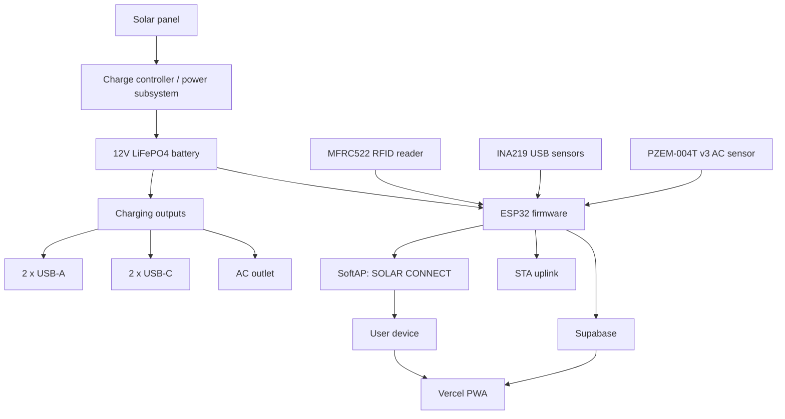
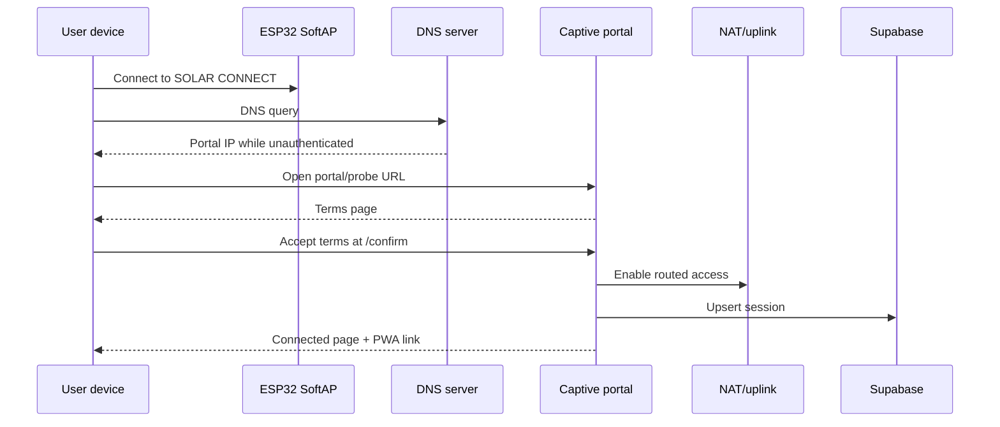
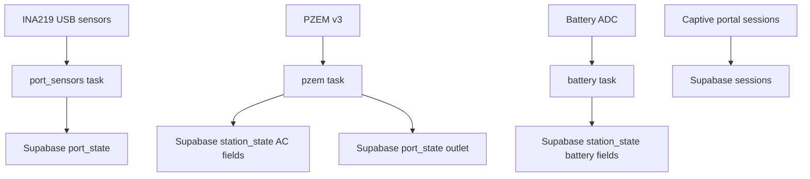

# System Architecture

Last updated: 2026-05-06

This document describes the architecture of the Smart Solar Hub thesis system and the current ESP32 firmware implementation in this repository.

The codebase is the source of truth. Architecture notes below distinguish current behavior from expected thesis behavior where they differ.

## 1. Purpose

Thesis title:

`Development and Implementation of Solar-Powered Smart Charging Station with Integrated Connectivity`

Station brand / SSID:

`SOLAR CONNECT`

The system combines:
- solar-powered charging hardware
- RFID-based activation
- managed Wi-Fi access
- battery-aware service degradation
- Supabase telemetry
- a Vercel-hosted PWA dashboard

## 2. System Scope

### In this repository

- ESP32 AP/STA networking
- captive portal
- DNS interception and per-client egress gating
- session timing and Supabase session sync
- RFID reader and charging power GPIO control
- USB INA219 sensing
- AC PZEM sensing
- battery ADC sensing and state machine
- local admin/test pages

### Outside this repository

- Vercel PWA source code
- live Supabase configuration outside committed SQL files
- physical solar charger, BMS, inverter, relay/MOSFET boards, and wiring
- PWA-side CO2 savings calculation and dashboard UI

## 3. High-Level Architecture



## 4. Layered Architecture

### 4.1 Power and Charging Layer

Physical responsibilities:
- harvest solar energy
- store energy in the LiFePO4 battery
- power USB-A, USB-C, and AC outputs
- protect hardware during low-battery conditions

Firmware touchpoints:
- GPIO 32 reads battery voltage through a resistor divider
- INA219 sensors read USB port current and bus voltage
- PZEM reads AC voltage/current/power/energy
- RFID task drives six power-control GPIOs
- battery state machine can block RFID-controlled outputs when enforcement is enabled

### 4.2 Embedded Control Layer

Owned by this repository.

Main responsibilities:
- initialize NVS, SPIFFS, Wi-Fi, sensors, and tasks
- manage AP/STA lifecycle
- coordinate battery state with user AP and port availability
- publish station telemetry to Supabase
- expose local maintenance surfaces

Key files:
- `main/esp32_nat_router.c`
- `main/battery_sensor.c`
- `main/rfid_reader.c`
- `main/port_sensors.c`
- `main/pzem_reader.c`
- `main/admin_ports.c`
- `main/supabase_client.c`

### 4.3 Network Access Layer

Main responsibilities:
- advertise `SOLAR CONNECT`
- present captive portal
- require terms acceptance
- grant internet for a timed session
- block unauthenticated clients
- keep MCU telemetry online through STA when configured and powered

Key files:
- `main/http_server.c`
- `main/dns_server.c`
- `main/lwip_hooks.c`
- `main/client_acl.c`
- `main/esp32_nat_router.c`

### 4.4 Cloud and PWA Layer

External to this repository except for its data contract.

Main responsibilities:
- display user countdown/session state
- display station battery and port state
- resolve linked browser installation identity
- compute estimated CO2 savings from firmware raw inputs

Contract file:
- `PWA_LINKING_CONTRACT.md`

## 5. Major Subsystems

### 5.1 Wi-Fi, Routing, and NAT

Current behavior:
- AP SSID defaults to `SOLAR CONNECT`
- AP password defaults empty unless configured
- STA uplink is optional
- Wi-Fi starts as AP or AP+STA depending on saved STA credentials
- `set_user_ap_enabled(true)` sets AP+STA mode
- `set_user_ap_enabled(false)` sets STA-only mode
- NAT is enabled after a client completes the portal flow
- NAT can be disabled when no active sessions remain

Important expected behavior:
- user Wi-Fi should also be unavailable when no valid RFID card is present

Current gap:
- RFID does not currently call `set_user_ap_enabled()`

### 5.2 Captive Portal

Current behavior:
- unauthenticated clients are redirected to `/`
- terms acceptance sends the client through `/confirm`
- `/confirm` grants or resumes a timed session
- connected page links to `https://solarconnect.live/?session_token=<token>`
- OS captive portal probe routes are handled explicitly

Implementation:
- `main/http_server.c`

### 5.3 DNS and Per-Client Enforcement

Current behavior:
- unauthenticated DNS A queries resolve to the ESP32 AP IP
- authenticated DNS queries are forwarded upstream
- `client_acl` admits or revokes clients
- lwIP IPv4 input hook drops non-admitted egress
- DHCP option 114 advertises the portal URL

Implementation:
- `main/dns_server.c`
- `main/client_acl.c`
- `main/lwip_hooks.c`

### 5.4 Session Management

Current behavior:
- each session gets a random `session_token`
- each client gets a stable `device_hash` when MAC lookup succeeds
- quota is 3600 seconds per day
- active sessions are RAM-only
- quota records are NVS-backed
- `DEV_RESET_QUOTA_ON_BOOT=1` clears quota records on every boot in dev mode
- Supabase heartbeat runs every 30 seconds

Implementation:
- `main/http_server.c`
- `main/supabase_client.c`

Production/demo note:
- set `DEV_RESET_QUOTA_ON_BOOT=0` when reboot should not refresh a user's daily hour

### 5.5 RFID Activation

Current behavior:
- MFRC522 on SPI3
- valid UID turns on six power-control GPIOs
- absent/invalid card turns them off
- 1 second presence timeout
- 50 ms poll interval
- `RFID_ENFORCE_AUTH=1` in local `.env`
- battery override can force ports off

Implementation:
- `main/rfid_reader.c`

Current gap:
- RFID presence is not wired into user Wi-Fi availability

Expected final behavior:
- valid RFID should enable both charging ports and user Wi-Fi
- absent/invalid RFID should disable both charging ports and user Wi-Fi

### 5.6 Battery Sensing and Threshold State Machine

Current behavior:
- GPIO 32 / ADC1 channel 4
- divider ratio `5.5454`
- voltage to percent is linear from 11.6 V to 13.9 V
- states: `normal`, `warning`, `critical`, `wake_up`, `charging_on`
- debounce: 6 samples x 5 seconds = 30 seconds
- publishes battery telemetry every 5 seconds

When `BATTERY_SENSOR_ENFORCE_THRESHOLDS=1`, side effects are:

| State | User AP | RFID-controlled ports |
|---|---:|---:|
| normal | on | allowed |
| warning | off | allowed |
| critical | off | blocked |
| wake_up | off | blocked |
| charging_on | off | allowed |

Current local config:
- `BATTERY_SENSOR_ENFORCE_THRESHOLDS=0`
- side effects are skipped in the local dev build

Implementation:
- `main/battery_sensor.h`
- `main/battery_sensor.c`

Current gap:
- thresholds are voltage-based and not calibrated to the expected percentage table
- no firmware-side 10% complete shutdown action exists

### 5.7 USB Port Sensing

Current behavior:
- four INA219 sensors are configured
- local reads include current and bus voltage
- status is `available` or `in_use` based on current threshold
- Supabase upserts happen on status flip and periodic heartbeat
- per-port daily in-use seconds are accumulated

Current address map:

| Port | Address |
|---|---:|
| USB-C 1 | `0x44` |
| USB-C 2 | `0x41` |
| USB-A 1 | `0x40` |
| USB-A 2 | `0x45` |

Supabase USB payload currently includes:
- `station_id`
- `port_key`
- `status`
- `daily_in_use_seconds`

Supabase USB payload currently omits:
- `current_ma`
- `bus_voltage_v`

Implementation:
- `main/port_sensors.c`
- `main/admin_ports.c`

Hardware caveat:
- USB-C INA219 boards are reported faulty on the current PCB revision

### 5.8 AC Outlet Sensing

Current behavior:
- PZEM-004T v3.0 Modbus RTU
- UART2 TX GPIO 17, RX GPIO 16
- 9600 baud
- one read returns voltage, current, power, energy, frequency, power factor, and alarm block
- `station_state` receives AC voltage/current/power/energy fields
- `port_state.outlet` receives `available`/`in_use` based on power threshold

Implementation:
- `main/pzem_reader.h`
- `main/pzem_reader.c`

Important correction:
- PZEM is not v1 in the current code
- PZEM is not log-only in the current code

### 5.9 Supabase Sync

Current firmware writes:

`sessions`
- session lifecycle
- remaining seconds
- status
- heartbeat
- connection state

`port_state`
- USB port status
- USB daily in-use seconds
- AC outlet status
- manual test UI updates

`station_state`
- battery percent
- battery voltage
- battery raw ADC mV
- battery state
- AC voltage/current/power/energy
- AC energy today

Implementation:
- `main/supabase_client.c`
- `supabase/*.sql`

### 5.10 Eco Metrics

Architecture decision:
- firmware publishes raw inputs
- PWA calculates estimated CO2 savings

Firmware raw inputs:
- `port_state.daily_in_use_seconds`
- `station_state.ac_energy_wh_today`

PWA formula:

```text
(10 * USB-A hours + 15 * USB-C hours + acEnergyWhToday) * 0.70 = grams CO2 saved
```

`main/eco_metrics.c` is disabled/stubbed and is not required for the current PWA-side estimate.

## 6. Runtime Flow

### 6.1 Boot Sequence

Current `app_main()` sequence:

1. initialize NVS
2. mount SPIFFS
3. load persisted router config
4. restore port map entries
5. initialize Wi-Fi
6. initialize port sensors
7. start port sensor Supabase sync
8. start RFID reader
9. start PZEM reader
10. start battery sensor
11. start network diagnostics
12. start LED task
13. start DNS and HTTP services if unlocked
14. initialize console
15. register CLI commands
16. enter console loop

### 6.2 User Network Flow



### 6.3 Telemetry Flow



## 7. Data Model Summary

### `sessions`

Purpose:
- track Wi-Fi access sessions and PWA linking

Firmware source:
- `main/http_server.c`

Important fields:
- `session_token`
- `device_hash`
- `installation_id`
- `remaining_seconds`
- `status`
- `ap_connected`
- `last_heartbeat`

### `port_state`

Purpose:
- one row per station output

Firmware sources:
- `main/port_sensors.c`
- `main/pzem_reader.c`
- `main/admin_ports.c`

Port keys:
- `usb_a_1`
- `usb_a_2`
- `usb_c_1`
- `usb_c_2`
- `outlet`

Current raw input for CO2:
- `daily_in_use_seconds`

### `station_state`

Purpose:
- one row per station with battery and AC telemetry

Firmware sources:
- `main/battery_sensor.c`
- `main/pzem_reader.c`

Battery fields:
- `battery_percent`
- `battery_voltage_v`
- `battery_raw_mv`
- `battery_state`

AC fields:
- `ac_voltage_v`
- `ac_current_a`
- `ac_power_w`
- `ac_energy_wh`
- `ac_energy_wh_today`

## 8. Current Gaps Against Thesis Behavior

| Area | Expected | Current |
|---|---|---|
| RFID and user Wi-Fi | RFID gates ports and user Wi-Fi | RFID gates ports only |
| Battery enforcement | thresholds actively control AP/ports | code exists, local `.env` disables side effects |
| Threshold calibration | percent thresholds | fixed voltage thresholds with linear percent estimate |
| Shutdown | firmware disables MCU Wi-Fi and shuts down cleanly | relies on hardware/MPPT cutoff |
| USB telemetry detail | status plus current/voltage if needed | status and seconds sent; current/voltage read locally but not sent |
| Quota after reboot | should survive production reboot | dev flag clears quota on every boot |
| Active sessions after reboot | should recover if required | RAM-only |
| USB-C sensing | four USB ports sensed | USB-C hardware faulty on current PCB |

## 9. Security and Demo Hardening

Current demo-grade defaults:
- AP can be open if no password is configured
- admin defaults to `admin / admin123`
- quota reset on boot is enabled
- active sessions are volatile
- local schema grants are permissive for integration testing

Before public demo:
- set a real admin password
- consider AP password policy if required
- set `DEV_RESET_QUOTA_ON_BOOT=0`
- verify Supabase RLS/API key posture
- decide whether RFID must gate user Wi-Fi

## 10. Recommended Ownership

Firmware should own:
- sensor reads
- raw telemetry publishing
- local access control
- local hardware control
- session timing

PWA should own:
- visual dashboard
- user-facing explanations
- estimated CO2 calculation
- linked browser installation state
- historical summaries and analytics

Supabase should own:
- persisted session rows
- latest station state
- latest port state
- RPCs for PWA linking

## 11. Conclusion

The firmware now covers most embedded responsibilities: captive portal, timed Wi-Fi access, RFID-controlled power pins, USB status telemetry, AC PZEM telemetry, battery telemetry, and Supabase sync.

The most important remaining architectural mismatch is RFID scope: the expected thesis behavior says RFID should gate user Wi-Fi as well as charging ports, while current code gates only the charging power outputs. The next most important items are enabling/calibrating battery threshold enforcement for real hardware, deciding production quota persistence behavior, and hardening demo credentials/access.
