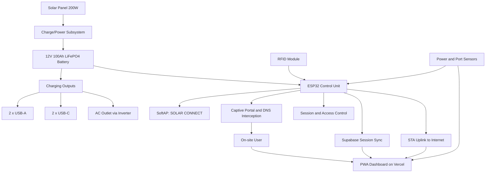
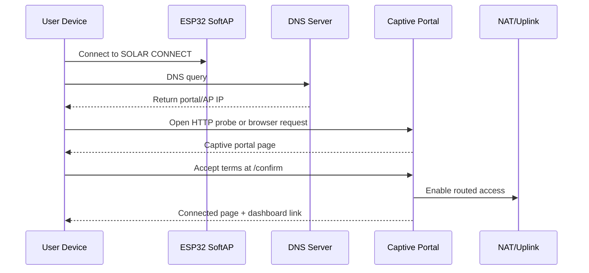
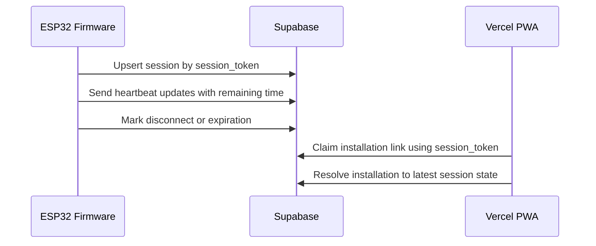

# System Architecture

## 1. Purpose

This document describes the system architecture of the thesis project:

`Development and Implementation of Solar-Powered Smart Charging Station with Integrated Connectivity`

The platform is presented to users as `The Smart Solar Hub`, with the local Wi-Fi access point branded as `SOLAR CONNECT`.

This documentation is intended for:
- developers working on the ESP32 firmware
- thesis/system documentation
- future integration work across firmware, dashboard, and hardware

## 2. System Scope

The full thesis system spans both hardware and software domains:
- solar-powered charging hardware
- embedded control and networking
- captive portal and access control
- cloud-connected dashboard services
- user-facing Progressive Web App (PWA)

Important scope note:
- This repository implements the `ESP32 connectivity firmware` layer plus the embedded sensing/control needed for the thesis: RFID activation, USB current sensing (INA219), AC monitoring (PZEM-004T), battery ADC + threshold-driven state machine, and Supabase telemetry
- The remote PWA is referenced by the firmware, but its source code is not included in this repository
- A few thesis-described features remain architectural targets — most importantly the PZEM → Supabase pipeline, battery threshold calibration to match the spec percentages, a firmware-side graceful shutdown, and real eco-metric calculation from INA219/PZEM data

## 3. Architectural Overview

The Smart Solar Hub is designed as an off-grid smart station that combines renewable energy, managed connectivity, and user-facing transparency.

At a high level, the architecture has four layers:
- `Power Layer`
- `Embedded Control Layer`
- `Network Access Layer`
- `Application and Cloud Layer`

## 4. Layered Architecture

### 4.1 Power Layer

The power layer provides the physical energy source and charging capability of the station.

Primary components:
- `200W monocrystalline solar panel`
- `12V 100Ah LiFePO4 battery`
- `pure sine wave inverter`
- `2 x USB-A charging ports`
- `2 x USB-C charging ports`
- `1 x AC outlet`

Responsibilities:
- harvest solar energy
- store energy in the battery
- supply regulated output to charging ports
- support off-grid station operation

Current repository status:
- The physical hardware lives outside this repository
- The firmware now monitors and reacts to battery voltage and per-port current/voltage:
  - GPIO 32 ADC → battery voltage / state-of-charge / state-machine label
  - I2C INA219s → per-USB-port current and bus voltage
  - UART2 PZEM-004T → AC voltage / current / power / cumulative energy
  - GPIO 12/14/27/26/25/13 → 4 MOSFETs, 1 SSR, 1 relay, gated by RFID + battery state

### 4.2 Embedded Control Layer

The embedded control layer is centered on the `ESP32 Wi-Fi Development Board`.

Responsibilities:
- initialize and manage the ESP32 runtime
- configure SoftAP and optional STA uplink
- serve the captive portal
- manage session-based internet access
- expose configuration interfaces
- coordinate remote status synchronization

Current implementation in this repository:
- [main/esp32_nat_router.c](c:\cp\esp32-wifi-ap-cp\main\esp32_nat_router.c)
- [main/http_server.c](c:\cp\esp32-wifi-ap-cp\main\http_server.c)
- [main/dns_server.c](c:\cp\esp32-wifi-ap-cp\main\dns_server.c)
- [main/lwip_hooks.c](c:\cp\esp32-wifi-ap-cp\main\lwip_hooks.c)
- [main/client_acl.c](c:\cp\esp32-wifi-ap-cp\main\client_acl.c)
- [main/admin_ports.c](c:\cp\esp32-wifi-ap-cp\main\admin_ports.c)
- [main/rfid_reader.c](c:\cp\esp32-wifi-ap-cp\main\rfid_reader.c)
- [main/port_sensors.c](c:\cp\esp32-wifi-ap-cp\main\port_sensors.c)
- [main/pzem_reader.c](c:\cp\esp32-wifi-ap-cp\main\pzem_reader.c)
- [main/battery_sensor.c](c:\cp\esp32-wifi-ap-cp\main\battery_sensor.c)
- [main/eco_metrics.c](c:\cp\esp32-wifi-ap-cp\main\eco_metrics.c)
- [main/net_diag.c](c:\cp\esp32-wifi-ap-cp\main\net_diag.c)
- [main/supabase_client.c](c:\cp\esp32-wifi-ap-cp\main\supabase_client.c)

### 4.3 Network Access Layer

The network access layer controls how users gain internet connectivity through the station.

Responsibilities:
- advertise the `SOLAR CONNECT` SSID
- intercept DNS and HTTP requests for captive portal behavior
- enforce terms acceptance before internet access
- track connection sessions
- forward authenticated traffic to the upstream network

This is the most mature and most fully implemented layer in the current repository.

### 4.4 Application and Cloud Layer

The application and cloud layer provides user-facing visibility beyond the ESP32 itself.

Primary external services:
- `Vercel-hosted PWA/dashboard`
- `Supabase backend for session state`

Responsibilities:
- display Wi-Fi session state
- present dashboard views to users
- support access from outside the local station network
- store or synchronize session-related data

Current repository status:
- the firmware generates dashboard links and sync requests
- the dashboard and backend are external dependencies, not part of this codebase

## 5. Major Subsystems

### 5.1 Captive Portal Subsystem

The captive portal subsystem is responsible for initial user onboarding on the station Wi-Fi network.

Main functions:
- serve the portal landing page
- display terms and conditions
- redirect OS captive portal probes
- transition authenticated users to the connected state

Implementation:
- [main/http_server.c](c:\cp\esp32-wifi-ap-cp\main\http_server.c)

Key routes:
- `/` for the landing page
- `/confirm` for access activation
- `/api/status` for session status
- probe and catch-all handlers for captive behavior

### 5.2 DNS Interception Subsystem

The DNS subsystem supports captive portal behavior by acting as the DNS server for SoftAP clients.

Main functions:
- answer unauthenticated DNS queries with the AP IP
- forward authenticated DNS queries upstream
- preserve portal interception until access is granted

Implementation:
- [main/dns_server.c](c:\cp\esp32-wifi-ap-cp\main\dns_server.c)

### 5.3 Routing and NAT Subsystem

The routing subsystem bridges the station's local AP network to an upstream Wi-Fi connection.

Main functions:
- run AP-only or AP+STA mode
- obtain upstream IP connectivity
- enable NAPT for downstream clients
- support optional port mapping

Implementation:
- [main/esp32_nat_router.c](c:\cp\esp32-wifi-ap-cp\main\esp32_nat_router.c)
- [components/cmd_router/cmd_router.c](c:\cp\esp32-wifi-ap-cp\components\cmd_router\cmd_router.c)

### 5.4 Session Management Subsystem

The session subsystem determines whether a client is allowed internet access.

Main functions:
- associate a client with a session
- compute remaining access time
- expose session status to the portal and dashboard handoff
- update remote session state

Current design characteristics:
- sessions are stored in RAM
- clients are matched through IP plus stable device identity where available
- the firmware generates a per-session random `session_token`
- the firmware generates a stable `device_hash` for cross-session linkage
- daily quota is currently hard-coded to `3600` seconds
- long-term PWA identity is expected to come from `installation_id`, not a permanent session token

Implementation:
- [main/http_server.c](c:\cp\esp32-wifi-ap-cp\main\http_server.c)

### 5.5 Configuration and Persistence Subsystem

The configuration subsystem stores operational settings and exposes maintenance controls.

Storage:
- NVS namespace: `esp32_nat`

Configuration surfaces:
- serial CLI
- HTTP admin page at `/config`

Persistent values include:
- STA credentials
- enterprise Wi-Fi settings
- static IP parameters
- AP SSID and password
- AP IP address
- port mapping table

Implementation:
- [components/cmd_router/cmd_router.c](c:\cp\esp32-wifi-ap-cp\components\cmd_router\cmd_router.c)
- [components/cmd_nvs/cmd_nvs.c](c:\cp\esp32-wifi-ap-cp\components\cmd_nvs\cmd_nvs.c)
- [main/pages.h](c:\cp\esp32-wifi-ap-cp\main\pages.h)

### 5.6 Diagnostics and Cloud Sync Subsystem

This subsystem adds observability and external synchronization.

Diagnostics responsibilities:
- snapshot network state
- record portal and NAPT state
- run active connectivity probes

Cloud sync responsibilities:
- create remote session records
- send session heartbeat updates
- mark disconnected clients
- generic `supabase_post_upsert()` shared by USB port telemetry, manual `/ports` toggles, and battery telemetry

Implementation:
- [main/net_diag.c](c:\cp\esp32-wifi-ap-cp\main\net_diag.c)
- [main/supabase_client.c](c:\cp\esp32-wifi-ap-cp\main\supabase_client.c)

### 5.7 RFID Activation Subsystem

The RFID subsystem physically gates the charging hardware.

Main functions:
- poll the MFRC522 reader over SPI3
- accept presence only for cards on the authorized 4-byte NUID list
- drive the 6 power-control GPIOs (4 MOSFETs + SSR + relay)
- expose a battery-driven override that forces ports off in Critical state

Implementation:
- [main/rfid_reader.c](c:\cp\esp32-wifi-ap-cp\main\rfid_reader.c)

### 5.8 Battery Sensing and State Machine Subsystem

Reads battery voltage from a resistor divider on GPIO 32 and runs the operational-threshold state machine.

Main functions:
- ADC1 channel 4 sampling with line/curve calibration
- voltage → percent estimator (linear over 11.6–13.6 V)
- five-state machine (`Normal / Warning / Critical / Wake Up / Charging On`) with 30 s debounce and hysteresis
- side effects: toggle the user AP via `set_user_ap_enabled()`, toggle RFID port allow via `rfid_reader_set_ports_allowed()`
- 5 s Supabase upsert of `battery_percent`, `battery_voltage_v`, `battery_raw_mv`, `battery_state`

Open work:
- Voltage thresholds and the linear curve don't yet match the thesis spec percentages
- Firmware-side action for the 10 % shutdown step is missing (delegated to MPPT)

Implementation:
- [main/battery_sensor.c](c:\cp\esp32-wifi-ap-cp\main\battery_sensor.c)

### 5.9 USB Port Sensing Subsystem (INA219)

Measures USB port current and bus voltage to classify each port as `available` or `in_use`.

Main functions:
- I2C bus on SDA=21 / SCL=22, 100 kHz, external pull-ups on the breakouts
- Four INA219s mapped per port_key (USB-C 1 / USB-C 2 / USB-A 1 / USB-A 2)
- Event-driven Supabase sync: pushes on status flip, plus 30 s heartbeat per port
- Live readings exposed at `/api/ports/sensors`; one-shot sync at `POST /api/ports/sensors/sync`; bus scan at `/api/ports/i2c-scan`

Hardware caveats:
- USB-C INA219s at 0x40 and 0x41 are reported faulty on the current PCB rev
- The live `/port-occupied` page intentionally only renders USB-A 1 and USB-A 2

Implementation:
- [main/port_sensors.c](c:\cp\esp32-wifi-ap-cp\main\port_sensors.c)
- [main/admin_ports.c](c:\cp\esp32-wifi-ap-cp\main\admin_ports.c)

### 5.10 AC Outlet Sensing Subsystem (PZEM-004T v1)

Reads AC mains telemetry from a Peacefair PZEM-004T v1 over UART2.

Main functions:
- 7-byte command / 7-byte response binary protocol (default device address 192.168.1.1)
- Sequential queries for voltage / current / power / cumulative energy every 5 s
- Logs readings to the serial console

Open work:
- Map current/power to `port_state.outlet` `available`/`in_use`
- Decide schema location (extend `station_state` or add a new table) for AC voltage / power / energy and push on the same cadence

Implementation:
- [main/pzem_reader.c](c:\cp\esp32-wifi-ap-cp\main\pzem_reader.c)

### 5.11 Eco Metrics Subsystem (stub)

Per-port energy accumulator that integrates current × voltage × time into watt-hours, then converts to grams CO₂ saved using a configurable grid emission factor.

Status:
- Module is wired in but `ECO_METRICS_ENABLED=0`
- The PWA fakes CO₂ savings client-side from `portsInUseCount × 3.5 g`

Implementation:
- [main/eco_metrics.c](c:\cp\esp32-wifi-ap-cp\main\eco_metrics.c)

## 6. Runtime Flow

### 6.1 Boot Sequence

On startup, the firmware performs the following sequence:
1. initialize NVS
2. mount SPIFFS assets
3. load persisted configuration
4. restore port map entries
5. initialize Wi-Fi in AP or AP+STA mode
6. start the port sensor task and its Supabase sync loop (gated on `PORT_SENSORS_ENABLED`)
7. start the RFID polling task
8. start the PZEM-004T reader task
9. start the battery sensor task (ADC + state machine + Supabase upsert)
10. start diagnostics and the LED status thread
11. start DNS and HTTP services if unlocked
12. register CLI commands
13. enter console loop

### 6.2 User Flow A: On-Site Network Connectivity

This is the primary implemented user flow.

1. The user connects to `SOLAR CONNECT`
2. The ESP32 presents itself as DNS for the AP network
3. DNS and HTTP traffic are intercepted to trigger the captive portal
4. The user lands on `/`
5. The user accepts the terms and proceeds to `/confirm`
6. The firmware starts or resumes a session
7. If uplink is available, NAT access is enabled
8. The connected page is shown
9. The connected page exposes the one-time PWA link:
   `https://solarconnect.live/?session_token=<token>`
10. The PWA binds the browser installation to the ESP32 device identity

### 6.3 User Flow B: Remote or Off-Station Dashboard Access

This is part of the intended full system but not fully implemented in this repository.

1. The user accesses the PWA from mobile data or another Wi-Fi network
2. The dashboard loads from Vercel
3. The PWA reads a persistent `installation_id`
4. The PWA asks Supabase to resolve the latest relevant session for that linked installation
5. If a linked session exists, the user's countdown/status is shown without needing the token in the URL again
6. If no linked session exists, the PWA shows instructions and a manual recovery link to `http://192.168.4.1/`

## 7. Data and Control Flow

### 7.1 Local Control Flow

### 7.2 Remote Sync Flow

## 8. Software Component Map

### 8.1 Core Firmware Components

- [main/esp32_nat_router.c](c:\cp\esp32-wifi-ap-cp\main\esp32_nat_router.c)
  Entry point, Wi-Fi lifecycle, NVS bootstrap, SPIFFS bootstrap, DNS and HTTP service startup.

- [main/http_server.c](c:\cp\esp32-wifi-ap-cp\main\http_server.c)
  Captive portal logic, admin HTTP interface, session management, connected page generation, dashboard handoff, and Supabase synchronization triggers.

- [main/dns_server.c](c:\cp\esp32-wifi-ap-cp\main\dns_server.c)
  DNS hijack behavior for unauthenticated users and upstream DNS forwarding for authenticated users.

- [main/net_diag.c](c:\cp\esp32-wifi-ap-cp\main\net_diag.c)
  Runtime diagnostics and active connectivity probes.

- [main/supabase_client.c](c:\cp\esp32-wifi-ap-cp\main\supabase_client.c)
  HTTPS calls for remote session persistence and heartbeat updates.

### 8.2 Supporting Components

- [components/cmd_router/cmd_router.c](c:\cp\esp32-wifi-ap-cp\components\cmd_router\cmd_router.c)
  Router-specific CLI commands.

- [components/cmd_nvs/cmd_nvs.c](c:\cp\esp32-wifi-ap-cp\components\cmd_nvs\cmd_nvs.c)
  Generic NVS management commands.

- [components/cmd_system/cmd_system.c](c:\cp\esp32-wifi-ap-cp\components\cmd_system\cmd_system.c)
  System and device diagnostics commands.

- [main/pages.h](c:\cp\esp32-wifi-ap-cp\main\pages.h)
  Embedded HTML for the admin/config interface.

## 9. Storage Architecture

### 9.1 NVS

NVS stores operational configuration such as:
- uplink SSID and password
- enterprise identity parameters
- static IP settings
- AP settings
- port mappings
- service lock state

### 9.2 SPIFFS

SPIFFS stores portal-related image assets used by the connected page:
- `cea.png`
- `dashboard.png`
- `dashboard-ui.png`

### 9.3 Volatile Runtime State

RAM-only runtime state includes:
- active sessions
- connected client count
- current AP and STA IP information
- heartbeat task state
- current NAPT state
- battery state-machine label and per-state debounce counters
- per-port `last_pushed_status` and `last_pushed_ts_ms` (used for event-driven INA219 sync)
- last successful PZEM read

### 9.4 Supabase Telemetry Tables

- `sessions` — captive portal session lifecycle and `installation_id` linkage
- `port_state` — one row per `(station_id, port_key)`; current/bus voltage from INA219; outlet still driven by `/ports` toggle
- `station_state` — single row per station with battery telemetry: `battery_percent`, `battery_voltage_v`, `battery_raw_mv`, `battery_state`, `updated_at`

Migrations are tracked in `supabase/`:
- `001_schema.sql` — current authoritative schema
- `002_port_state_sensor_metrics.sql` — adds `current_ma` and `bus_voltage_v` to `port_state`
- `003_station_state_battery_telemetry.sql` — adds `battery_voltage_v`, `battery_raw_mv`, `battery_state` to `station_state`

## 10. Security and Access Model

### 10.1 Intended Access Model

The intended user access policy is:
- user connects locally
- user accepts terms
- user receives limited-time internet access
- usage is constrained for fairness

### 10.2 Current Firmware Enforcement Model

The current code enforces access through:
- captive portal interception
- in-memory session tracking
- DNS-based gating
- HTTP route gating
- NAT activation after acceptance

### 10.3 Current Security Limitations

Known limitations in the present implementation:
- active sessions are RAM-only, so recovery across ESP32 reboot is incomplete
- admin credentials are hard-coded
- NAT enablement is global rather than strict per-client isolation
- sensitive configuration data is exposed in logs and CLI output
- the firmware cannot guarantee that operating systems will auto-open the captive portal popup on every reconnect
- the full one-time-link and generic-dashboard experience depends on the external PWA implementing the documented `installation_id <-> device_hash` flow

## 11. Implemented Features vs Planned Thesis Features

### 11.1 Implemented in Current Repository

- SoftAP with captive portal onboarding
- optional STA uplink (kept up across all non-shutdown battery states for telemetry)
- DNS interception for captive portal behavior
- Per-client lwIP IPv4 input hook + ACL for strict per-client egress
- DHCP option 114 portal advertisement
- HTTP portal and admin interface
- session timer, daily-quota table (NVS-backed), and session status API
- external dashboard handoff
- Supabase session synchronization hooks
- CLI configuration and diagnostics
- RFID-based physical activation using MFRC522 (with battery override)
- USB port current/voltage sensing via INA219 (USB-A 1/2 working; USB-C 1/2 PCB-faulty)
- Battery ADC reading + voltage-driven state machine with hysteresis and 30 s debounce
- Battery telemetry to Supabase (`battery_percent`, `battery_voltage_v`, `battery_raw_mv`, `battery_state`)
- AC outlet read via PZEM-004T v1 (logging only — Supabase pipeline not yet wired)
- Coordinated power state: state machine drives `set_user_ap_enabled()` and `rfid_reader_set_ports_allowed()`

### 11.2 Planned or External to This Repository

- PZEM AC telemetry pipeline into Supabase (`port_state.outlet` and AC voltage/power/energy)
- Battery threshold calibration to match the thesis spec percentages (currently mismatched — see PROJECT_CONTEXT.md)
- LiFePO4-shaped SoC curve (replace the linear 11.6–13.6 V mapping)
- Firmware-side graceful shutdown action at 10 % (currently delegated to MPPT cut)
- Eco-achievement and CO₂ savings calculations driven by real INA219/PZEM data (`eco_metrics.c` is wired but disabled)
- Robust reboot recovery for active sessions
- USB-C INA219 PCB rev fix to enable live USB-C readings
- Campus announcements module in the PWA
- Complete context-aware remote dashboard experience

## 12. Recommended Architectural Boundary

For future development, the system should be treated as three coordinated deliverables:

### 12.1 Firmware Layer

Owned by this repository.

Best suited for:
- Wi-Fi access control
- portal logic
- local device state
- sensor ingestion
- hardware interface logic
- secure communication with backend services

### 12.2 Dashboard and Backend Layer

External to this repository.

Best suited for:
- user dashboards
- historical records
- announcement content
- eco-impact visualization
- remote availability and analytics
- `installation_id` creation and persistence
- one-time link claiming through `session_token`
- generic dashboard resolution through linked `device_hash`

### 12.3 Hardware and Energy Layer

Physical subsystem outside the software repository.

Best suited for:
- solar charging hardware
- battery management integration
- charging port power distribution
- inverter and protection design
- RFID wiring and sensor integration

## 13. Conclusion

The current codebase covers most of the Smart Solar Hub's embedded responsibilities. The captive portal and per-client gating remain the most polished surface, but the firmware now also drives RFID activation, USB INA219 telemetry, AC reading via PZEM-004T, and a battery-driven operational-threshold state machine that toggles the user AP and the RFID-controlled ports.

Remaining firmware work is narrow but pointed: calibrate the battery thresholds to match the thesis-spec percentages, replace the linear `voltage → percent` curve with a LiFePO4-shaped lookup, push PZEM data into Supabase, add a firmware-side graceful-shutdown action, and turn the eco-metrics module on so CO₂ savings reflect real energy. The PWA in the sibling repo should evolve to render the new `battery_state`, `battery_voltage_v`, and (once wired) AC fields.

For the current PWA-linking direction, the most important architectural rule is unchanged:
- the first successful redirect link is the one-time bind
- later visits should resolve by `installation_id` and `device_hash`
- the local `http://192.168.4.1/` page is the manual recovery path when the user missed the first redirect link
- captive popup behavior should not be treated as a guaranteed re-entry mechanism
