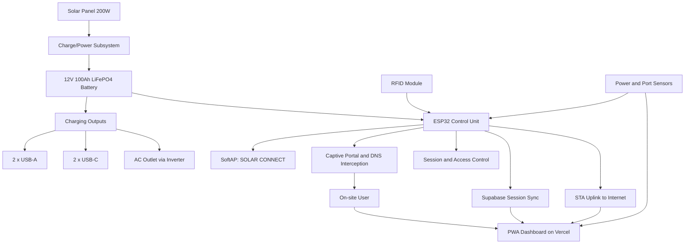
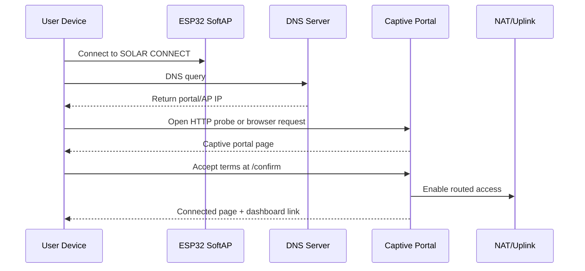
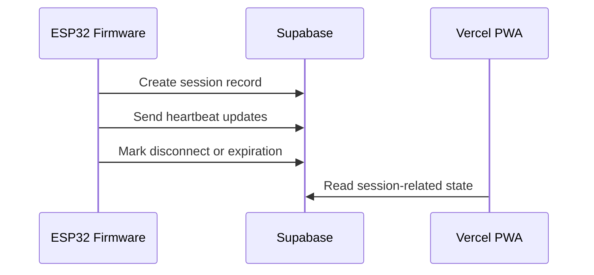

# System Architecture

## 1. Purpose

This document describes the system architecture of the thesis project:

`Development and Implementation of Solar-Powered Smart Charging Station with Integrated Connectivity`

The platform is presented to users as `The Smart Solar Hub`, with the local Wi-Fi access point branded as `SOLAR CONNECT`.

This documentation is intended for:
- developers working on the ESP32 firmware
- thesis/system documentation
- future integration work across firmware, dashboard, and hardware

## 2. System Scope

The full thesis system spans both hardware and software domains:
- solar-powered charging hardware
- embedded control and networking
- captive portal and access control
- cloud-connected dashboard services
- user-facing Progressive Web App (PWA)

Important scope note:
- This repository currently implements the `ESP32 connectivity firmware` layer
- The remote PWA is referenced by the firmware, but its source code is not included in this repository
- Some thesis-described features remain architectural targets and are not yet implemented in this codebase

## 3. Architectural Overview

The Smart Solar Hub is designed as an off-grid smart station that combines renewable energy, managed connectivity, and user-facing transparency.

At a high level, the architecture has four layers:
- `Power Layer`
- `Embedded Control Layer`
- `Network Access Layer`
- `Application and Cloud Layer`

## 4. Layered Architecture

### 4.1 Power Layer

The power layer provides the physical energy source and charging capability of the station.

Primary components:
- `200W monocrystalline solar panel`
- `12V 100Ah LiFePO4 battery`
- `pure sine wave inverter`
- `2 x USB-A charging ports`
- `2 x USB-C charging ports`
- `1 x AC outlet`

Responsibilities:
- harvest solar energy
- store energy in the battery
- supply regulated output to charging ports
- support off-grid station operation

Current repository status:
- this layer is part of the overall thesis architecture
- its monitoring and control logic is not yet implemented in this repository

### 4.2 Embedded Control Layer

The embedded control layer is centered on the `ESP32 Wi-Fi Development Board`.

Responsibilities:
- initialize and manage the ESP32 runtime
- configure SoftAP and optional STA uplink
- serve the captive portal
- manage session-based internet access
- expose configuration interfaces
- coordinate remote status synchronization

Current implementation in this repository:
- [main/esp32_nat_router.c](c:\Users\Phoebe Rhone Gangoso\Downloads\esp32-wifi-ap-cp\main\esp32_nat_router.c)
- [main/http_server.c](c:\Users\Phoebe Rhone Gangoso\Downloads\esp32-wifi-ap-cp\main\http_server.c)
- [main/dns_server.c](c:\Users\Phoebe Rhone Gangoso\Downloads\esp32-wifi-ap-cp\main\dns_server.c)
- [main/net_diag.c](c:\Users\Phoebe Rhone Gangoso\Downloads\esp32-wifi-ap-cp\main\net_diag.c)
- [main/supabase_client.c](c:\Users\Phoebe Rhone Gangoso\Downloads\esp32-wifi-ap-cp\main\supabase_client.c)

### 4.3 Network Access Layer

The network access layer controls how users gain internet connectivity through the station.

Responsibilities:
- advertise the `SOLAR CONNECT` SSID
- intercept DNS and HTTP requests for captive portal behavior
- enforce terms acceptance before internet access
- track connection sessions
- forward authenticated traffic to the upstream network

This is the most mature and most fully implemented layer in the current repository.

### 4.4 Application and Cloud Layer

The application and cloud layer provides user-facing visibility beyond the ESP32 itself.

Primary external services:
- `Vercel-hosted PWA/dashboard`
- `Supabase backend for session state`

Responsibilities:
- display Wi-Fi session state
- present dashboard views to users
- support access from outside the local station network
- store or synchronize session-related data

Current repository status:
- the firmware generates dashboard links and sync requests
- the dashboard and backend are external dependencies, not part of this codebase

## 5. Major Subsystems

### 5.1 Captive Portal Subsystem

The captive portal subsystem is responsible for initial user onboarding on the station Wi-Fi network.

Main functions:
- serve the portal landing page
- display terms and conditions
- redirect OS captive portal probes
- transition authenticated users to the connected state

Implementation:
- [main/http_server.c](c:\Users\Phoebe Rhone Gangoso\Downloads\esp32-wifi-ap-cp\main\http_server.c)

Key routes:
- `/` for the landing page
- `/confirm` for access activation
- `/api/status` for session status
- probe and catch-all handlers for captive behavior

### 5.2 DNS Interception Subsystem

The DNS subsystem supports captive portal behavior by acting as the DNS server for SoftAP clients.

Main functions:
- answer unauthenticated DNS queries with the AP IP
- forward authenticated DNS queries upstream
- preserve portal interception until access is granted

Implementation:
- [main/dns_server.c](c:\Users\Phoebe Rhone Gangoso\Downloads\esp32-wifi-ap-cp\main\dns_server.c)

### 5.3 Routing and NAT Subsystem

The routing subsystem bridges the station's local AP network to an upstream Wi-Fi connection.

Main functions:
- run AP-only or AP+STA mode
- obtain upstream IP connectivity
- enable NAPT for downstream clients
- support optional port mapping

Implementation:
- [main/esp32_nat_router.c](c:\Users\Phoebe Rhone Gangoso\Downloads\esp32-wifi-ap-cp\main\esp32_nat_router.c)
- [components/cmd_router/cmd_router.c](c:\Users\Phoebe Rhone Gangoso\Downloads\esp32-wifi-ap-cp\components\cmd_router\cmd_router.c)

### 5.4 Session Management Subsystem

The session subsystem determines whether a client is allowed internet access.

Main functions:
- associate a client with a session
- compute remaining access time
- expose session status to the portal and dashboard handoff
- update remote session state

Current design characteristics:
- sessions are stored in RAM
- clients are primarily tracked by IP address
- MAC-derived tokens are used for dashboard and backend sync
- session duration is currently hard-coded in firmware

Implementation:
- [main/http_server.c](c:\Users\Phoebe Rhone Gangoso\Downloads\esp32-wifi-ap-cp\main\http_server.c)

### 5.5 Configuration and Persistence Subsystem

The configuration subsystem stores operational settings and exposes maintenance controls.

Storage:
- NVS namespace: `esp32_nat`

Configuration surfaces:
- serial CLI
- HTTP admin page at `/config`

Persistent values include:
- STA credentials
- enterprise Wi-Fi settings
- static IP parameters
- AP SSID and password
- AP IP address
- port mapping table

Implementation:
- [components/cmd_router/cmd_router.c](c:\Users\Phoebe Rhone Gangoso\Downloads\esp32-wifi-ap-cp\components\cmd_router\cmd_router.c)
- [components/cmd_nvs/cmd_nvs.c](c:\Users\Phoebe Rhone Gangoso\Downloads\esp32-wifi-ap-cp\components\cmd_nvs\cmd_nvs.c)
- [main/pages.h](c:\Users\Phoebe Rhone Gangoso\Downloads\esp32-wifi-ap-cp\main\pages.h)

### 5.6 Diagnostics and Cloud Sync Subsystem

This subsystem adds observability and external synchronization.

Diagnostics responsibilities:
- snapshot network state
- record portal and NAPT state
- run active connectivity probes

Cloud sync responsibilities:
- create remote session records
- send session heartbeat updates
- mark disconnected clients

Implementation:
- [main/net_diag.c](c:\Users\Phoebe Rhone Gangoso\Downloads\esp32-wifi-ap-cp\main\net_diag.c)
- [main/supabase_client.c](c:\Users\Phoebe Rhone Gangoso\Downloads\esp32-wifi-ap-cp\main\supabase_client.c)

## 6. Runtime Flow

### 6.1 Boot Sequence

On startup, the firmware performs the following sequence:
1. initialize NVS
2. mount SPIFFS assets
3. load persisted configuration
4. restore port map entries
5. initialize Wi-Fi in AP or AP+STA mode
6. start diagnostics and LED status thread
7. start DNS and HTTP services if unlocked
8. register CLI commands
9. enter console loop

### 6.2 User Flow A: On-Site Network Connectivity

This is the primary implemented user flow.

1. The user connects to `SOLAR CONNECT`
2. The ESP32 presents itself as DNS for the AP network
3. DNS and HTTP traffic are intercepted to trigger the captive portal
4. The user lands on `/`
5. The user accepts the terms and proceeds to `/confirm`
6. The firmware starts or resumes a session
7. If uplink is available, NAT access is enabled
8. The connected page is shown
9. The user may open the external dashboard link

### 6.3 User Flow B: Remote or Off-Station Dashboard Access

This is part of the intended full system but not fully implemented in this repository.

1. The user accesses the PWA from mobile data or another Wi-Fi network
2. The dashboard loads from Vercel
3. Session-related status is inferred from remote/backend state
4. Local-only station access state is not fully available unless the user entered through the station network

## 7. Data and Control Flow

### 7.1 Local Control Flow

### 7.2 Remote Sync Flow

## 8. Software Component Map

### 8.1 Core Firmware Components

- [main/esp32_nat_router.c](c:\Users\Phoebe Rhone Gangoso\Downloads\esp32-wifi-ap-cp\main\esp32_nat_router.c)
  Entry point, Wi-Fi lifecycle, NVS bootstrap, SPIFFS bootstrap, DNS and HTTP service startup.

- [main/http_server.c](c:\Users\Phoebe Rhone Gangoso\Downloads\esp32-wifi-ap-cp\main\http_server.c)
  Captive portal logic, admin HTTP interface, session management, connected page generation, dashboard handoff, and Supabase synchronization triggers.

- [main/dns_server.c](c:\Users\Phoebe Rhone Gangoso\Downloads\esp32-wifi-ap-cp\main\dns_server.c)
  DNS hijack behavior for unauthenticated users and upstream DNS forwarding for authenticated users.

- [main/net_diag.c](c:\Users\Phoebe Rhone Gangoso\Downloads\esp32-wifi-ap-cp\main\net_diag.c)
  Runtime diagnostics and active connectivity probes.

- [main/supabase_client.c](c:\Users\Phoebe Rhone Gangoso\Downloads\esp32-wifi-ap-cp\main\supabase_client.c)
  HTTPS calls for remote session persistence and heartbeat updates.

### 8.2 Supporting Components

- [components/cmd_router/cmd_router.c](c:\Users\Phoebe Rhone Gangoso\Downloads\esp32-wifi-ap-cp\components\cmd_router\cmd_router.c)
  Router-specific CLI commands.

- [components/cmd_nvs/cmd_nvs.c](c:\Users\Phoebe Rhone Gangoso\Downloads\esp32-wifi-ap-cp\components\cmd_nvs\cmd_nvs.c)
  Generic NVS management commands.

- [components/cmd_system/cmd_system.c](c:\Users\Phoebe Rhone Gangoso\Downloads\esp32-wifi-ap-cp\components\cmd_system\cmd_system.c)
  System and device diagnostics commands.

- [main/pages.h](c:\Users\Phoebe Rhone Gangoso\Downloads\esp32-wifi-ap-cp\main\pages.h)
  Embedded HTML for the admin/config interface.

## 9. Storage Architecture

### 9.1 NVS

NVS stores operational configuration such as:
- uplink SSID and password
- enterprise identity parameters
- static IP settings
- AP settings
- port mappings
- service lock state

### 9.2 SPIFFS

SPIFFS stores portal-related image assets used by the connected page:
- `cea.png`
- `dashboard.png`
- `dashboard-ui.png`

### 9.3 Volatile Runtime State

RAM-only runtime state includes:
- active sessions
- connected client count
- current AP and STA IP information
- heartbeat task state
- current NAPT state

## 10. Security and Access Model

### 10.1 Intended Access Model

The intended user access policy is:
- user connects locally
- user accepts terms
- user receives limited-time internet access
- usage is constrained for fairness

### 10.2 Current Firmware Enforcement Model

The current code enforces access through:
- captive portal interception
- in-memory session tracking
- DNS-based gating
- HTTP route gating
- NAT activation after acceptance

### 10.3 Current Security Limitations

Known limitations in the present implementation:
- session duration in code is `60 seconds`, not `1 hour per day`
- session tracking is not yet a durable daily quota system
- admin credentials are hard-coded
- NAT enablement is global rather than strict per-client isolation
- sensitive configuration data is exposed in logs and CLI output

## 11. Implemented Features vs Planned Thesis Features

### 11.1 Implemented in Current Repository

- SoftAP with captive portal onboarding
- optional STA uplink
- DNS interception for captive portal behavior
- HTTP portal and admin interface
- session timer and session status API
- external dashboard handoff
- Supabase session synchronization hooks
- CLI configuration and diagnostics

### 11.2 Planned or External to This Repository

- RFID-based physical activation using MFRC522
- charging-port availability sensing
- current draw monitoring per port
- battery and solar telemetry
- eco-achievement and CO2 savings calculations
- campus announcements module in the PWA
- complete context-aware remote dashboard experience
- full daily quota enforcement policy

## 12. Recommended Architectural Boundary

For future development, the system should be treated as three coordinated deliverables:

### 12.1 Firmware Layer

Owned by this repository.

Best suited for:
- Wi-Fi access control
- portal logic
- local device state
- sensor ingestion
- hardware interface logic
- secure communication with backend services

### 12.2 Dashboard and Backend Layer

External to this repository.

Best suited for:
- user dashboards
- historical records
- announcement content
- eco-impact visualization
- remote availability and analytics

### 12.3 Hardware and Energy Layer

Physical subsystem outside the software repository.

Best suited for:
- solar charging hardware
- battery management integration
- charging port power distribution
- inverter and protection design
- RFID wiring and sensor integration

## 13. Conclusion

The current codebase already provides a strong architecture for the `connectivity and access-control` portion of the Smart Solar Hub. Its strongest implemented area is the local captive portal and managed Wi-Fi flow.

However, the complete thesis system is larger than the current firmware. The architecture should therefore be understood as a multi-layer platform in which this repository is the embedded networking core, while the charging, sensing, and richer dashboard features remain either future integration work or external system components.
